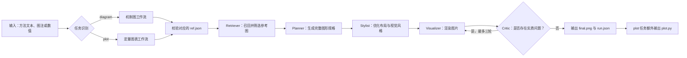

# PaperBanana Codex

面向 Codex 的学术插图生成技能。它根据论文方法描述、图注或结构化实验数据，生成学术机制图、模型架构图、研究流程图和定量图表。

本项目使用 [PaperBananaBench](https://huggingface.co/datasets/dwzhu/PaperBananaBench) 作为只读的少样本参考库，默认通过 Codex 原生能力完成规划、绘制与多轮检查，不会使用数据集训练或微调模型。

## 功能

- `diagram`：生成算法框架、模型架构、科学机制、系统流程等示意图。
- `plot`：根据结构化数值生成柱状图、折线图、散点图等实验图表。
- 自动检索相关参考图，并进行布局和风格重排。
- 最多执行三轮 Critic 检查与修正。
- 默认使用 Codex 原生后端；仅在用户明确要求时调用已配置的 Gemini 或 OpenRouter API。
- 保存最终图片、运行清单，以及定量图表对应的 Python 代码。

## 安装

将仓库克隆到 Codex 的技能目录：

### Windows PowerShell

```powershell
git clone https://github.com/shushushulian/papebanana.git `
  "$HOME\.codex\skills\paperbanana-codex"
```

### macOS / Linux

```bash
git clone https://github.com/shushushulian/papebanana.git \
  ~/.codex/skills/paperbanana-codex
```

安装后重新启动 Codex，或新建一个会话。技能目录顶层应直接包含 `SKILL.md`。

## 配置 PaperBananaBench

1. 下载 [PaperBananaBench](https://huggingface.co/datasets/dwzhu/PaperBananaBench)。
2. 解压后确认数据集根目录包含 `diagram/` 和 `plot/`。
3. 保存数据集位置：

```powershell
python "$HOME\.codex\skills\paperbanana-codex\scripts\configure.py" `
  --dataset-root "D:\datasets\PaperBananaBench"
```

也可以通过环境变量临时指定：

```powershell
$env:PAPERBANANA_BENCH_ROOT = "D:\datasets\PaperBananaBench"
```

技能只读取任务对应的 `ref.json` 和参考图片，绝不会把 `test.json` 用作参考来源。

## 使用方法

在 Codex 中明确调用 `$paperbanana-codex`，并提供方法描述、图注、源文件或结构化数据。

### 生成机制图

```text
请使用 $paperbanana-codex，根据下面的方法描述生成一张横向学术机制图。
图注：图 1，多模态特征融合与预测框架。
方法描述：图像编码器与文本编码器分别提取特征，经交叉注意力模块融合，
再由分类头输出预测结果。
```

### 生成定量图表

```text
请使用 $paperbanana-codex 生成分组柱状图。
横轴：Model A、Model B、Ours
Accuracy：81.2、84.7、89.3
F1：79.8、83.5、88.6
要求：适合论文双栏排版，标注具体数值。
```

未提供图注时，技能会根据输入生成简短图注。默认生成一个候选结果，并执行最多三轮 Critic 检查。

## 主要流程



1. **任务识别**

   将算法、架构、机制和工作流归为 `diagram`，将数值实验结果归为 `plot`。

2. **数据校验**

   按“本次请求指定路径 → `PAPERBANANA_BENCH_ROOT` → 已保存配置”的顺序定位数据集，只校验当前任务需要的数据。

3. **Retriever**

   根据领域、图形类型、主要模块和关系构造检索语句，从完整 `ref.json` 中召回 20 个候选；检查最多 8 张领先参考图，最终保留不超过 5 张。参考图只用于理解结构和风格，不复制与当前输入无关的标签或结论。

4. **Planner**

   把原始内容转换为完整图形规格，包括模块、层级、数据流、箭头方向、标签和版面关系。

5. **Stylist**

   在不改变科学含义和数值的前提下，优化配色、间距、对齐、字体层级和论文排版适配性。

6. **Visualizer**

   `diagram` 默认调用 Codex 图像生成能力；`plot` 在隔离环境中执行受约束的 Python 绘图代码。

7. **Critic**

   对照原始输入、图注和图形规格检查事实一致性、模块遗漏、箭头方向、文字、数值、坐标轴、图例与可读性。存在实质问题时进行修正，最多三轮。

8. **保存产物**

   每次运行创建独立目录。机制图输出 `final.png` 和 `run.json`；定量图表额外输出可复现的 `plot.py`。清单只保存源内容哈希，不保存原始文本或密钥。

## 后端说明

### Codex 原生后端

默认且推荐的方式：

- 机制图使用 Codex 图像生成能力。
- 定量图表使用隔离的绘图运行环境。
- 不会因为本机存在 API 密钥而自动调用外部服务。

首次生成定量图表时，如果隔离环境尚未安装，Codex 会说明所需操作并等待确认。

### 可选 API 后端

只有在用户明确要求使用自己的 API 时，才会启用 Gemini 或 OpenRouter。配置模板位于 `configs/model_config.template.yaml`，实际配置默认保存到：

```text
$CODEX_HOME/paperbanana/configs/model_config.yaml
```

请勿提交包含 API 密钥的配置文件。

## 项目结构

```text
.
├── SKILL.md                  # Codex 技能入口与执行规则
├── agents/openai.yaml        # 技能元数据
├── configs/                  # 可选 API 配置模板
├── references/               # diagram/plot 工作流与风格规范
├── scripts/                  # 数据校验、检索、运行时与产物管理
├── requirements-api.txt      # 可选 API 后端依赖
└── requirements-plot.txt     # 隔离绘图环境依赖
```

## 致谢

本技能的研究思路和多角色流程参考了 [dwzhu-pku/PaperBanana](https://github.com/dwzhu-pku/PaperBanana)。衷心感谢 PaperBanana 的作者与贡献者为自动化学术插图生成所做的研究和开源工作。

参考数据集：[PaperBananaBench](https://huggingface.co/datasets/dwzhu/PaperBananaBench)。

本仓库是面向 Codex 的独立适配项目，并非 PaperBanana 官方发行版。

## License

[Apache License 2.0](LICENSE)
